	

![Star][gh-stars-badge]
[![Created By][by-badge]][guz-website]
[![Support Ko-Fi][support-kofi-badge]][support-kofi]
[![Support BuyMeACoffee][support-coffee-badge]][support-coffee]

	<samp><i><small>
		 English
		&bull;
		<a href="https://github.com/LoredDev/.github/blob/main/profile/README-pt.md">
			 Portuguese
		</a>
	</small></i></samp>

Welcome to Lored! The incubator name and organization of all libraries, tools, configs, and resources
made for developers by [@Guz013](https://github.com/Guz013). This is a project created
out of passion and a need for a dedicated space to share and store of all repositories related to improving, 
streamlining, strengthening, speeding up and simply making the developer experience more satisfying and fun.

Feel free to explore, use, modify and contribute any repository you find interesting or useful. 
All of them are licensed under permissive licenses.

<em>
	<small>
		<samp>
			This is a new and premature project <del>and developer</del> with not a lot of experience, 
			but with a lot of ideas for the future. And what's the best way to learn something? Doing it!
		</samp>
	</small>
</em>

<h3 align="center">by developers, to  developers</h3>

---

<small align="center">
	<a href="https://github.com/LoredDev/.github/blob/main/LICENSE-CC-BY-SA-4.0">CC BY-SA 4.0</a> 
	&copy; Gustavo "Guz" L. de Mello
</small>

[gh-stars-badge]: https://img.shields.io/github/stars/loreddev?style=for-the-badge&logo=Github&logoColor=ffffff&labelColor=000000&color=ffffff

[support-kofi]: https://www.ko-fi.com/guz013
[support-kofi-badge]: https://img.shields.io/badge/Ko--Fi-white?style=for-the-badge&labelColor=000000&color=ffffff&&logoColor=ffffff&logo=kofi&label=Support%20on

[support-coffee]: https://www.buymeacoffee.com/guz013
[support-coffee-badge]: https://img.shields.io/badge/BuyMeACoffee-white?style=for-the-badge&labelColor=000000&color=ffffff&&logoColor=ffffff&logo=buymeacoffee&label=Support%20on

[by-badge]: https://img.shields.io/badge/Guz013-white?style=for-the-badge&labelColor=000000&color=ffffff&&logoColor=ffffff&label=An%20Org%20of
[guz-website]: https://guz.one
